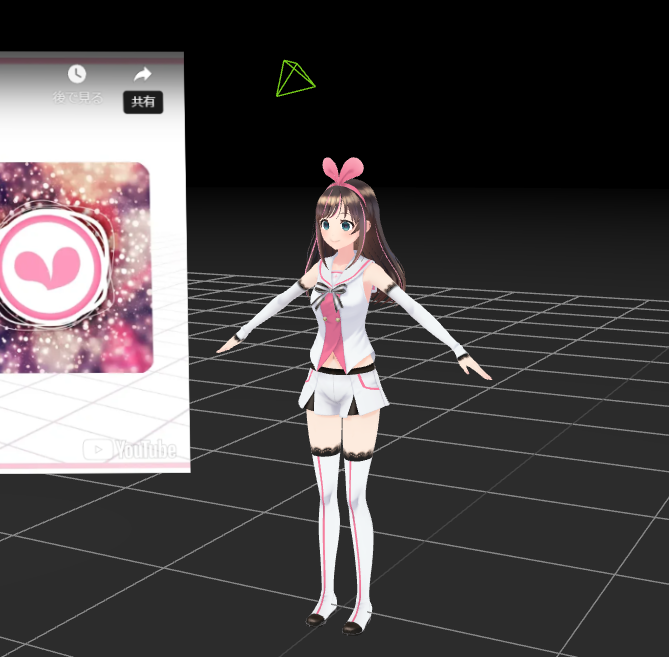
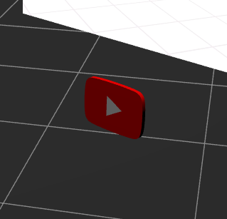
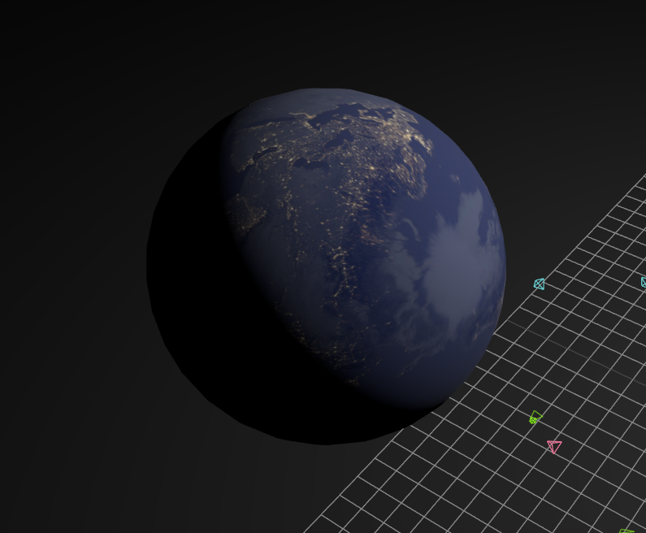

# Three.js Touch the Beat! Menu Scene

[日本語バージョンはこちら](/docs/README-ja.md)

| This Repository                                                | Original                                                    |
| -------------------------------------------------------------- | ----------------------------------------------------------- |
| <video src="docs/this.mp4" controls title="This Repository" /> | <video src="docs/original.mp4" controls title="Original" /> |

This is a repository where I tried to recreate the background particles of the menu screen displayed at the launch of the [Kizuna AI - Touch the Beat!](https://www.oculus.com/deeplink/?action=view&path=/app/3857024597703276&ref=oculus_desktop) app for Meta Quest as an exercise in Three.js. It supports WebXR.

[Live Demo](https://fugamaru.com/projects/three-js-touch-the-beat-menu-scene/)

(※ For copyright reasons, video files will not play in the above live demo. Also, since CSS3DRenderer cannot be used under WebXR environment, iframes for embedding YouTube videos will not be displayed under this environment.)

## How to launch the local environment server

```bash
# Prepare your own video files for playback and place them in a specified location with a specified file name.
$ mv "path/to/Hello, Morning MusicVideo.mp4" public/hello-morning.mp4
$ npm i
$ npm run dev
```

Additionally, if you would like to try it on WebXR, please set it up so that you can access it via https. (WebXR can only be activated in an https environment.)

The `vite.config.ts` contains a template for setting up self-signed certificates. [Reference Link](https://qiita.com/Nicasdream0/items/d6db6fcfc145ce6ca1b4)

## License

### Kizuna AI



This work is based on "Kizuna AI" (https://sketchfab.com/3d-models/kizuna-ai-c9eb5d213fe54a96a4b3b77a7b509920) by Adipriatna (https://sketchfab.com/adipriatna) licensed under CC-BY-4.0 (http://creativecommons.org/licenses/by/4.0/)

### YouTube Playback Button



This work is based on "YouTube Button" (https://sketchfab.com/3d-models/youtube-button-7637735caf264433bcdadcb03747bcc0) by LordOfTheSnow (https://sketchfab.com/LordOfTheSnow) licensed under CC-BY-SA-4.0 (http://creativecommons.org/licenses/by-sa/4.0/)

### Earth Nightmap Texture



[Solar System Scope](https://www.solarsystemscope.com/textures/)
