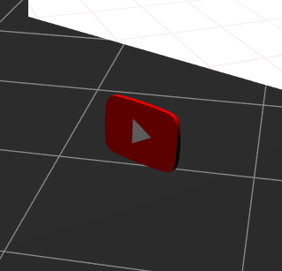

# Three.js Touch the Beat! Menu Scene

| 本リポジトリ                                              | オリジナル                                             |
| --------------------------------------------------------- | ------------------------------------------------------ |
| <video src="this.mp4" controls title="This Repository" /> | <video src="original.mp4" controls title="Original" /> |

Meta Quest向けアプリ [Kizuna AI - Touch the Beat!](https://www.oculus.com/deeplink/?action=view&path=/app/3857024597703276&ref=oculus_desktop) の起動時に表示されるメニュー画面の背景パーティクルを、Three.jsの練習がてら再現してみたリポジトリです。WebXRに対応しています。

[ライブデモ](https://fugamaru.com/projects/three-js-touch-the-beat-menu-scene/)

(※ 著作権の都合上動画ファイルは上記のライブデモでは再生されません。また、CSS3DRendererがWebXR環境下で使用できないため、YouTube動画埋め込み用のiframeは同環境下では表示されません。)

## ローカル環境の起動方法

```bash
# 動画再生用に各自動画ファイルを準備して、指定のファイル名で指定の場所に置く
$ mv "path/to/Hello, MorningのMV.mp4" public/hello-morning.mp4
$ npm i
$ npm run dev
```

加えて、WebXRでも試してみたい方は、httpsでアクセスできるように設定してください。(WebXRはhttps環境でないと起動できない)

`vite.config.ts`にオレオレ証明書設定用のテンプレートを記載しています。 [参考リンク](https://qiita.com/Nicasdream0/items/d6db6fcfc145ce6ca1b4)

## ライセンス

### キズナアイ


This work is based on "Kizuna AI" (https://sketchfab.com/3d-models/kizuna-ai-c9eb5d213fe54a96a4b3b77a7b509920) by Adipriatna (https://sketchfab.com/adipriatna) licensed under CC-BY-4.0 (http://creativecommons.org/licenses/by/4.0/)

### YouTubeの再生ボタン



This work is based on "YouTube Button" (https://sketchfab.com/3d-models/youtube-button-7637735caf264433bcdadcb03747bcc0) by LordOfTheSnow (https://sketchfab.com/LordOfTheSnow) licensed under CC-BY-SA-4.0 (http://creativecommons.org/licenses/by-sa/4.0/)

### Earth Nightmap Texture


[Solar System Scope](https://www.solarsystemscope.com/textures/)
